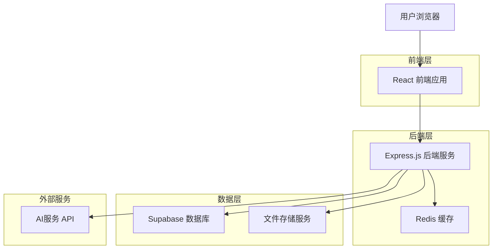
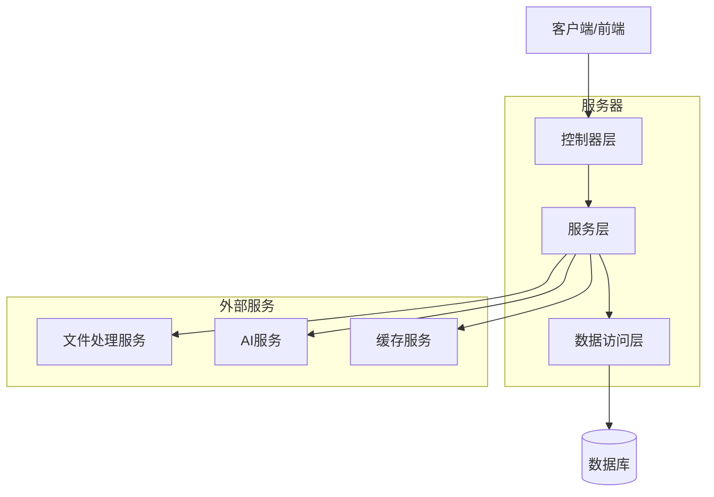

# TinyWow 克隆版技术架构文档

## 1. 架构设计



## 2. 技术描述

- **前端**: React@18 + TypeScript + Tailwind CSS + Vite + React Router
- **后端**: Express.js@4 + TypeScript + Multer (文件上传)
- **数据库**: Supabase (PostgreSQL)
- **缓存**: Redis@7
- **文件存储**: Supabase Storage
- **AI服务**: OpenAI API, Stability AI API
- **PDF处理**: pdf-lib, PDFtk
- **图像处理**: Sharp, Canvas API
- **视频处理**: FFmpeg

## 3. 路由定义

| 路由 | 用途 |
|------|------|
| / | 首页，展示工具分类和热门工具 |
| /pdf | PDF工具页面，显示所有PDF相关工具 |
| /image | 图像工具页面，显示所有图像处理工具 |
| /ai-writing | AI写作工具页面，显示所有AI写作工具 |
| /video | 视频工具页面，显示所有视频处理工具 |
| /tool/:toolId | 工具详情页面，单个工具的使用界面 |
| /login | 用户登录页面 |
| /register | 用户注册页面 |
| /profile | 用户中心页面，账户管理和使用历史 |
| /pricing | 定价页面，高级会员功能介绍 |

## 4. API 定义

### 4.1 核心 API

**用户认证相关**
```
POST /api/auth/register
```

请求参数:
| 参数名 | 参数类型 | 是否必需 | 描述 |
|--------|----------|----------|------|
| email | string | true | 用户邮箱 |
| password | string | true | 用户密码 |
| name | string | true | 用户姓名 |

响应:
| 参数名 | 参数类型 | 描述 |
|--------|----------|------|
| success | boolean | 注册是否成功 |
| user | object | 用户信息 |
| token | string | JWT认证令牌 |

示例:
```json
{
  "email": "user@example.com",
  "password": "password123",
  "name": "张三"
}
```

**文件处理相关**
```
POST /api/tools/pdf/merge
```

请求参数:
| 参数名 | 参数类型 | 是否必需 | 描述 |
|--------|----------|----------|------|
| files | File[] | true | 要合并的PDF文件数组 |
| order | number[] | false | 文件合并顺序 |

响应:
| 参数名 | 参数类型 | 描述 |
|--------|----------|------|
| success | boolean | 处理是否成功 |
| downloadUrl | string | 处理结果下载链接 |
| fileSize | number | 文件大小（字节）|

**AI工具相关**
```
POST /api/tools/ai/generate-image
```

请求参数:
| 参数名 | 参数类型 | 是否必需 | 描述 |
|--------|----------|----------|------|
| prompt | string | true | 图像生成提示词 |
| style | string | false | 图像风格 |
| size | string | false | 图像尺寸 |

响应:
| 参数名 | 参数类型 | 描述 |
|--------|----------|------|
| success | boolean | 生成是否成功 |
| imageUrl | string | 生成图像的URL |
| prompt | string | 使用的提示词 |

## 5. 服务器架构图



## 6. 数据模型

### 6.1 数据模型定义


### 6.2 数据定义语言

**用户表 (users)**
```sql
-- 创建用户表
CREATE TABLE users (
    id UUID PRIMARY KEY DEFAULT gen_random_uuid(),
    email VARCHAR(255) UNIQUE NOT NULL,
    password_hash VARCHAR(255) NOT NULL,
    name VARCHAR(100) NOT NULL,
    plan VARCHAR(20) DEFAULT 'free' CHECK (plan IN ('free', 'premium')),
    usage_count INTEGER DEFAULT 0,
    created_at TIMESTAMP WITH TIME ZONE DEFAULT NOW(),
    updated_at TIMESTAMP WITH TIME ZONE DEFAULT NOW()
);

-- 创建索引
CREATE INDEX idx_users_email ON users(email);
CREATE INDEX idx_users_plan ON users(plan);
```

**工具表 (tools)**
```sql
-- 创建工具表
CREATE TABLE tools (
    id UUID PRIMARY KEY DEFAULT gen_random_uuid(),
    name VARCHAR(100) NOT NULL,
    description TEXT,
    category VARCHAR(50) NOT NULL,
    endpoint VARCHAR(200) NOT NULL,
    is_active BOOLEAN DEFAULT true,
    usage_count INTEGER DEFAULT 0,
    created_at TIMESTAMP WITH TIME ZONE DEFAULT NOW()
);

-- 创建索引
CREATE INDEX idx_tools_category ON tools(category);
CREATE INDEX idx_tools_active ON tools(is_active);
```

**工具分类表 (tool_categories)**
```sql
-- 创建工具分类表
CREATE TABLE tool_categories (
    id UUID PRIMARY KEY DEFAULT gen_random_uuid(),
    name VARCHAR(50) NOT NULL,
    description TEXT,
    icon VARCHAR(100),
    sort_order INTEGER DEFAULT 0
);

-- 插入初始数据
INSERT INTO tool_categories (name, description, icon, sort_order) VALUES
('PDF', 'PDF文档处理工具', 'pdf-icon', 1),
('Image', '图像处理和编辑工具', 'image-icon', 2),
('AI Writing', 'AI驱动的写作工具', 'writing-icon', 3),
('Video', '视频处理和转换工具', 'video-icon', 4);
```

**使用历史表 (usage_history)**
```sql
-- 创建使用历史表
CREATE TABLE usage_history (
    id UUID PRIMARY KEY DEFAULT gen_random_uuid(),
    user_id UUID REFERENCES users(id),
    tool_id UUID REFERENCES tools(id),
    file_name VARCHAR(255),
    file_size INTEGER,
    status VARCHAR(20) DEFAULT 'processing' CHECK (status IN ('processing', 'completed', 'failed')),
    created_at TIMESTAMP WITH TIME ZONE DEFAULT NOW()
);

-- 创建索引
CREATE INDEX idx_usage_history_user_id ON usage_history(user_id);
CREATE INDEX idx_usage_history_tool_id ON usage_history(tool_id);
CREATE INDEX idx_usage_history_created_at ON usage_history(created_at DESC);
```

**文件表 (files)**
```sql
-- 创建文件表
CREATE TABLE files (
    id UUID PRIMARY KEY DEFAULT gen_random_uuid(),
    user_id UUID REFERENCES users(id),
    original_name VARCHAR(255) NOT NULL,
    stored_name VARCHAR(255) NOT NULL,
    file_type VARCHAR(50) NOT NULL,
    file_size INTEGER NOT NULL,
    storage_path VARCHAR(500) NOT NULL,
    created_at TIMESTAMP WITH TIME ZONE DEFAULT NOW(),
    expires_at TIMESTAMP WITH TIME ZONE DEFAULT NOW() + INTERVAL '1 hour'
);

-- 创建索引
CREATE INDEX idx_files_user_id ON files(user_id);
CREATE INDEX idx_files_expires_at ON files(expires_at);

-- 设置权限
GRANT SELECT ON tool_categories TO anon;
GRANT SELECT ON tools TO anon;
GRANT ALL PRIVILEGES ON users TO authenticated;
GRANT ALL PRIVILEGES ON usage_history TO authenticated;
GRANT ALL PRIVILEGES ON files TO authenticated;
```