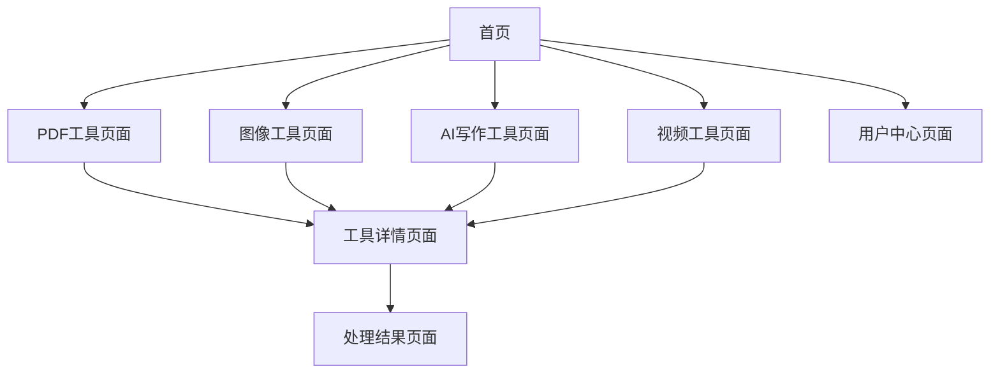

# TinyWow 克隆版产品需求文档

## 1. 产品概述

TinyWow 克隆版是一个免费的在线工具平台，提供超过150种实用工具，包括PDF处理、图像编辑、AI写作、视频处理等功能。<mcreference link="https://tinywow.com/" index="0">0</mcreference> <mcreference link="https://siteefy.com/ai-tools/tinywow/" index="2">2</mcreference>

- 解决用户在文档处理、图像编辑、内容创作等方面的日常需求，无需下载安装任何软件
- 目标用户包括学生、教育工作者、内容创作者、专业人士等需要快速便捷工具的用户群体
- 打造一站式免费工具平台，提升用户工作效率，降低使用门槛

## 2. 核心功能

### 2.1 用户角色

| 角色 | 注册方式 | 核心权限 |
|------|----------|----------|
| 访客用户 | 无需注册 | 可使用所有基础工具，有文件大小限制和广告 |
| 高级用户 | 邮箱注册升级 | 无广告体验，更大文件限制，优先处理 |

### 2.2 功能模块

我们的 TinyWow 克隆版包含以下主要页面：

1. **首页**：工具分类导航、搜索功能、热门工具展示、用户指南
2. **PDF工具页面**：PDF合并、分割、转换、编辑、压缩等30+工具
3. **图像工具页面**：AI图像生成、背景处理、格式转换、OCR等40+工具
4. **AI写作工具页面**：文章生成、脚本创作、内容优化等20+工具
5. **视频工具页面**：视频压缩、格式转换、编辑等15+工具
6. **工具详情页面**：单个工具的使用界面、说明和操作区域
7. **用户中心页面**：账户管理、使用历史、升级选项

### 2.3 页面详情

| 页面名称 | 模块名称 | 功能描述 |
|----------|----------|----------|
| 首页 | 导航栏 | 显示主要工具分类，搜索框，用户登录/注册入口 |
| 首页 | 工具分类卡片 | 展示PDF、图像、AI写作、视频四大工具分类，每个分类显示工具数量和热门工具 |
| 首页 | 热门工具区域 | 展示最受欢迎的12个工具，包括工具图标、名称和简短描述 |
| 首页 | 特色介绍 | 突出平台优势：免费使用、无需注册、150+工具、安全可靠 |
| PDF工具页面 | 工具网格 | 展示所有PDF相关工具，包括合并、分割、转换、编辑、压缩、加密等 |
| PDF工具页面 | 工具搜索 | 快速查找特定PDF工具的搜索功能 |
| 图像工具页面 | AI工具区域 | AI图像生成、智能背景移除、对象移除等AI驱动的图像工具 |
| 图像工具页面 | 基础编辑工具 | 裁剪、调整大小、格式转换、压缩等基础图像处理工具 |
| 图像工具页面 | OCR工具 | 图像文字识别和提取功能 |
| AI写作工具页面 | 内容生成器 | 文章写作、论文生成、故事创作、脚本编写等AI写作工具 |
| AI写作工具页面 | 内容优化器 | 语法检查、内容改写、摘要生成等内容优化工具 |
| 视频工具页面 | 格式转换 | 支持多种视频格式之间的转换 |
| 视频工具页面 | 视频编辑 | 基础的视频剪辑、压缩、合并功能 |
| 工具详情页面 | 文件上传区域 | 支持拖拽上传、点击选择文件、URL输入等多种上传方式 |
| 工具详情页面 | 参数设置 | 根据不同工具提供相应的参数配置选项 |
| 工具详情页面 | 处理结果 | 显示处理进度、结果预览、下载链接 |
| 工具详情页面 | 使用说明 | 工具使用步骤、支持格式、注意事项等信息 |
| 用户中心页面 | 账户信息 | 用户基本信息、会员状态、使用统计 |
| 用户中心页面 | 历史记录 | 用户使用工具的历史记录和文件管理 |
| 用户中心页面 | 升级选项 | 高级会员功能介绍和订阅选项 |

## 3. 核心流程

**访客用户流程：**
用户访问首页 → 浏览工具分类或搜索工具 → 选择需要的工具 → 上传文件或输入内容 → 设置参数（如需要）→ 开始处理 → 查看结果并下载

**注册用户流程：**
用户注册/登录 → 享受无广告体验 → 使用工具（更大文件限制）→ 查看使用历史 → 考虑升级高级会员

**管理员流程：**
管理员登录 → 监控系统状态 → 管理用户账户 → 更新工具功能 → 查看使用统计

## 4. 用户界面设计

### 4.1 设计风格

- **主色调**：深蓝色 (#1e40af) 和亮蓝色 (#3b82f6)，传达专业和可信赖感
- **辅助色**：浅灰色 (#f8fafc) 背景，白色 (#ffffff) 卡片，绿色 (#10b981) 成功状态
- **按钮样式**：圆角矩形按钮，悬停时有阴影效果和颜色变化
- **字体**：主要使用 Inter 字体，中文使用苹方或微软雅黑，标题 24-32px，正文 14-16px
- **布局风格**：卡片式设计，网格布局，顶部导航栏，响应式设计
- **图标风格**：使用 Heroicons 或 Feather Icons，简洁线性图标风格

### 4.2 页面设计概览

| 页面名称 | 模块名称 | UI元素 |
|----------|----------|--------|
| 首页 | 导航栏 | 深蓝色背景，白色文字，Logo左对齐，菜单居中，登录按钮右对齐 |
| 首页 | 英雄区域 | 大标题"免费在线工具平台"，副标题介绍，搜索框，渐变背景 |
| 首页 | 工具分类 | 4个大卡片，每个卡片有图标、标题、工具数量、"查看全部"按钮 |
| 首页 | 热门工具 | 3x4网格布局，每个工具卡片包含图标、名称、简短描述 |
| 工具页面 | 工具网格 | 响应式网格，每个工具卡片悬停时有阴影效果和轻微放大 |
| 工具详情页面 | 上传区域 | 虚线边框的拖拽区域，支持文件图标和"点击或拖拽上传"文字 |
| 工具详情页面 | 处理按钮 | 大号蓝色按钮，处理时显示加载动画和进度条 |
| 工具详情页面 | 结果区域 | 成功时显示绿色背景的结果卡片，包含预览和下载按钮 |

### 4.3 响应式设计

- **桌面优先设计**：主要针对桌面端用户体验优化
- **移动端适配**：在平板和手机上自动调整布局，工具网格变为单列或双列
- **触摸优化**：按钮和交互元素在移动端有足够的点击区域（最小44px）
- **性能优化**：图片懒加载，工具按需加载，确保移动端快速响应