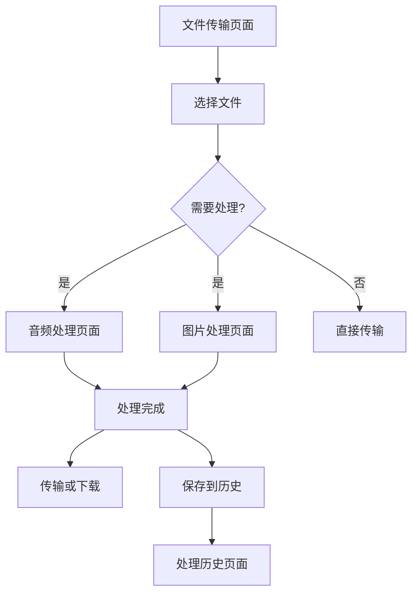

# 文件处理功能扩展 - 产品需求文档

## 1. 产品概述

基于现有的DropShare文件传输平台，扩展文件处理功能，为用户提供音频格式转换、图片格式转换压缩和图片编辑等一站式文件处理服务。
- 解决用户在文件传输过程中的格式转换和编辑需求，提升用户体验和平台价值。
- 目标用户：需要快速处理和分享文件的个人用户和小团队。
- 市场价值：将简单的文件传输工具升级为综合性文件处理平台，增强用户粘性和使用频率。

## 2. 核心功能

### 2.1 用户角色

| 角色 | 注册方式 | 核心权限 |
|------|----------|----------|
| 普通用户 | 无需注册，直接使用 | 基础文件传输、简单格式转换 |
| 高级用户 | 可选注册，保存偏好设置 | 批量处理、高级编辑功能、处理历史 |

### 2.2 功能模块

我们的文件处理扩展包含以下主要页面：
1. **文件传输页面**：原有传输功能，新增处理选项入口
2. **音频处理页面**：音频格式转换、压缩、基础编辑
3. **图片处理页面**：图片格式转换、压缩、编辑工具
4. **处理历史页面**：查看处理记录、重新下载结果
5. **设置页面**：处理偏好、质量设置、快捷操作配置

### 2.3 页面详情

| 页面名称 | 模块名称 | 功能描述 |
|----------|----------|----------|
| 文件传输页面 | 处理选项面板 | 在传输前/后提供格式转换选项，支持批量处理设置 |
| 音频处理页面 | 格式转换器 | 支持MP3、WAV、AAC、FLAC、OGG等格式互转 |
| 音频处理页面 | 音频编辑器 | 音频裁剪、音量调节、淡入淡出效果 |
| 图片处理页面 | 格式转换器 | 支持JPEG、PNG、WebP、GIF、BMP等格式互转 |
| 图片处理页面 | 压缩优化器 | 智能压缩、质量调节、尺寸调整 |
| 图片处理页面 | 图片编辑器 | 裁剪、旋转、滤镜、亮度对比度调节、色彩调整 |
| 处理历史页面 | 历史记录 | 显示处理记录、原文件信息、处理参数、结果下载 |
| 设置页面 | 偏好设置 | 默认输出格式、质量设置、自动处理规则 |

## 3. 核心流程

### 普通用户流程
用户上传文件 → 选择处理类型（音频/图片） → 设置转换参数 → 开始处理 → 预览结果 → 下载或直接传输

### 批量处理流程
用户选择多个文件 → 设置统一处理规则 → 批量处理 → 查看处理进度 → 批量下载或传输

### 集成传输流程
用户选择文件进行传输 → 系统检测文件类型 → 提示是否需要处理 → 用户选择处理选项 → 处理完成后自动传输

## 4. 用户界面设计

### 4.1 设计风格
- 主色调：保持现有的蓝色主题 (#3367d6)，新增橙色辅助色 (#ff6b35) 用于处理功能
- 按钮风格：圆角设计，支持深色/浅色主题切换
- 字体：保持现有字体系统，处理功能使用稍大字号突出重要性
- 布局风格：卡片式布局，顶部导航，支持拖拽操作
- 图标风格：线性图标，配合动画效果

### 4.2 页面设计概览

| 页面名称 | 模块名称 | UI元素 |
|----------|----------|--------|
| 文件传输页面 | 处理选项面板 | 悬浮按钮、快速设置卡片、处理预览窗口 |
| 音频处理页面 | 格式选择器 | 下拉菜单、格式图标、质量滑块、预设选项 |
| 音频处理页面 | 波形编辑器 | 波形显示、时间轴、裁剪控制、播放控制 |
| 图片处理页面 | 编辑工具栏 | 工具图标、参数面板、实时预览、撤销重做 |
| 图片处理页面 | 预览区域 | 缩放控制、网格显示、对比视图、全屏预览 |
| 处理历史页面 | 记录列表 | 时间线布局、文件缩略图、处理状态、操作按钮 |

### 4.3 响应式设计
桌面优先设计，完全适配移动端，支持触摸手势操作，针对平板设备优化编辑界面布局。