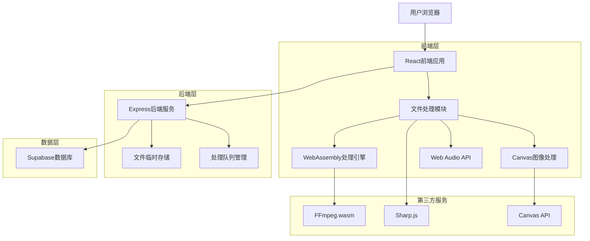
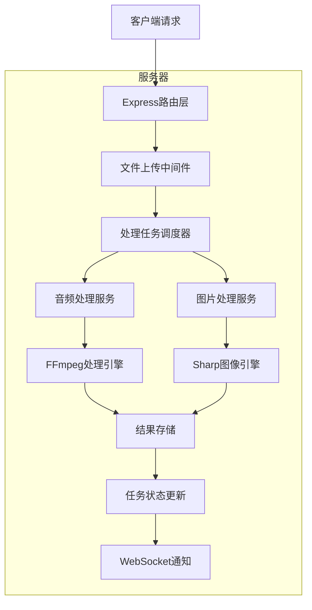
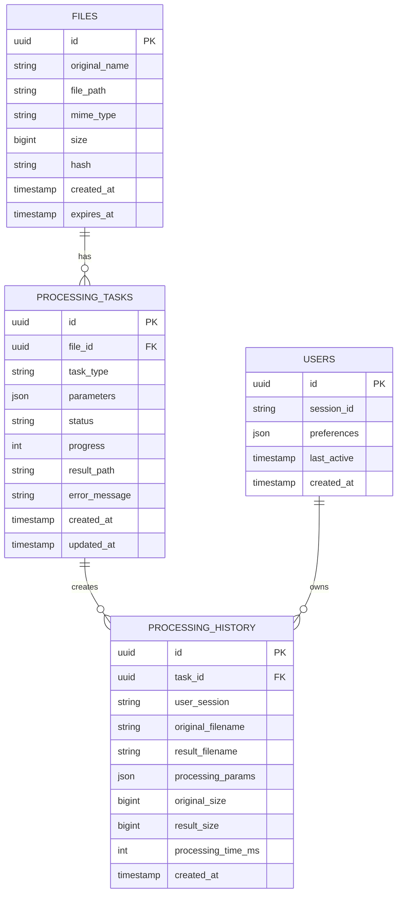

# 文件处理功能扩展 - 技术架构文档

## 1. 架构设计



## 2. 技术描述

* 前端：React\@18 + TypeScript + Vite + TailwindCSS

* 后端：Express\@4 + Node.js

* 数据库：Supabase (PostgreSQL)

* 文件处理：FFmpeg.wasm + Sharp.js + Canvas API

* 实时通信：WebSocket (现有)

* 存储：临时文件存储 + Supabase Storage

## 3. 路由定义

| 路由                  | 用途             |
| ------------------- | -------------- |
| /                   | 主页，包含文件传输和处理入口 |
| /audio-processor    | 音频处理页面         |
| /image-processor    | 图片处理页面         |
| /processing-history | 处理历史页面         |
| /settings           | 设置页面           |

## 4. API定义

### 4.1 核心API

**文件上传处理**

```
POST /api/files/upload
```

请求：

| 参数名称        | 参数类型   | 是否必需  | 描述               |
| ----------- | ------ | ----- | ---------------- |
| file        | File   | true  | 要处理的文件           |
| processType | string | true  | 处理类型：audio/image |
| options     | object | false | 处理选项             |

响应：

| 参数名称         | 参数类型   | 描述     |
| ------------ | ------ | ------ |
| fileId       | string | 文件唯一标识 |
| originalName | string | 原始文件名  |
| size         | number | 文件大小   |
| type         | string | 文件类型   |

**音频格式转换**

```
POST /api/audio/convert
```

请求：

| 参数名称         | 参数类型   | 是否必需  | 描述                    |
| ------------ | ------ | ----- | --------------------- |
| fileId       | string | true  | 文件ID                  |
| targetFormat | string | true  | 目标格式：mp3/wav/aac/flac |
| quality      | number | false | 音质设置 0-10             |
| bitrate      | string | false | 比特率设置                 |

响应：

| 参数名称          | 参数类型   | 描述        |
| ------------- | ------ | --------- |
| taskId        | string | 处理任务ID    |
| status        | string | 处理状态      |
| estimatedTime | number | 预计处理时间(秒) |

**图片处理**

```
POST /api/image/process
```

请求：

| 参数名称         | 参数类型   | 是否必需  | 描述     |
| ------------ | ------ | ----- | ------ |
| fileId       | string | true  | 文件ID   |
| operations   | array  | true  | 处理操作列表 |
| targetFormat | string | false | 目标格式   |
| quality      | number | false | 压缩质量   |

操作示例：

```json
{
  "fileId": "abc123",
  "operations": [
    {"type": "resize", "width": 800, "height": 600},
    {"type": "rotate", "angle": 90},
    {"type": "filter", "name": "brightness", "value": 1.2}
  ],
  "targetFormat": "webp",
  "quality": 80
}
```

**处理状态查询**

```
GET /api/tasks/{taskId}/status
```

响应：

| 参数名称      | 参数类型   | 描述                                  |
| --------- | ------ | ----------------------------------- |
| status    | string | pending/processing/completed/failed |
| progress  | number | 处理进度 0-100                          |
| resultUrl | string | 结果文件下载链接                            |
| error     | string | 错误信息(如果失败)                          |

**处理历史**

```
GET /api/history
```

响应：

| 参数名称    | 参数类型   | 描述     |
| ------- | ------ | ------ |
| records | array  | 处理记录列表 |
| total   | number | 总记录数   |
| page    | number | 当前页码   |

## 5. 服务器架构图



## 6. 数据模型

### 6.1 数据模型定义



### 6.2 数据定义语言

**文件表 (files)**

```sql
-- 创建文件表
CREATE TABLE files (
    id UUID PRIMARY KEY DEFAULT gen_random_uuid(),
    original_name VARCHAR(255) NOT NULL,
    file_path VARCHAR(500) NOT NULL,
    mime_type VARCHAR(100) NOT NULL,
    size BIGINT NOT NULL,
    hash VARCHAR(64) UNIQUE,
    created_at TIMESTAMP WITH TIME ZONE DEFAULT NOW(),
    expires_at TIMESTAMP WITH TIME ZONE DEFAULT (NOW() + INTERVAL '24 hours')
);

-- 创建索引
CREATE INDEX idx_files_hash ON files(hash);
CREATE INDEX idx_files_expires_at ON files(expires_at);
```

**处理任务表 (processing\_tasks)**

```sql
-- 创建处理任务表
CREATE TABLE processing_tasks (
    id UUID PRIMARY KEY DEFAULT gen_random_uuid(),
    file_id UUID REFERENCES files(id) ON DELETE CASCADE,
    task_type VARCHAR(50) NOT NULL CHECK (task_type IN ('audio_convert', 'image_process', 'batch_process')),
    parameters JSONB NOT NULL,
    status VARCHAR(20) DEFAULT 'pending' CHECK (status IN ('pending', 'processing', 'completed', 'failed')),
    progress INTEGER DEFAULT 0 CHECK (progress >= 0 AND progress <= 100),
    result_path VARCHAR(500),
    error_message TEXT,
    created_at TIMESTAMP WITH TIME ZONE DEFAULT NOW(),
    updated_at TIMESTAMP WITH TIME ZONE DEFAULT NOW()
);

-- 创建索引
CREATE INDEX idx_processing_tasks_file_id ON processing_tasks(file_id);
CREATE INDEX idx_processing_tasks_status ON processing_tasks(status);
CREATE INDEX idx_processing_tasks_created_at ON processing_tasks(created_at DESC);
```

**处理历史表 (processing\_history)**

```sql
-- 创建处理历史表
CREATE TABLE processing_history (
    id UUID PRIMARY KEY DEFAULT gen_random_uuid(),
    task_id UUID REFERENCES processing_tasks(id),
    user_session VARCHAR(100),
    original_filename VARCHAR(255) NOT NULL,
    result_filename VARCHAR(255),
    processing_params JSONB,
    original_size BIGINT,
    result_size BIGINT,
    processing_time_ms INTEGER,
    created_at TIMESTAMP WITH TIME ZONE DEFAULT NOW()
);

-- 创建索引
CREATE INDEX idx_processing_history_user_session ON processing_history(user_session);
CREATE INDEX idx_processing_history_created_at ON processing_history(created_at DESC);
```

**用户偏好表 (users)**

```sql
-- 创建用户表
CREATE TABLE users (
    id UUID PRIMARY KEY DEFAULT gen_random_uuid(),
    session_id VARCHAR(100) UNIQUE NOT NULL,
    preferences JSONB DEFAULT '{}',
    last_active TIMESTAMP WITH TIME ZONE DEFAULT NOW(),
    created_at TIMESTAMP WITH TIME ZONE DEFAULT NOW()
);

-- 创建索引
CREATE INDEX idx_users_session_id ON users(session_id);
CREATE INDEX idx_users_last_active ON users(last_active DESC);

-- 初始化数据
INSERT INTO users (session_id, preferences) VALUES 
('demo_session', '{
  "audio": {
    "defaultFormat": "mp3",
    "defaultQuality": 8,
    "defaultBitrate": "192k"
  },
  "image": {
    "defaultFormat": "webp",
    "defaultQuality": 80,
    "autoCompress": true
  }
}');
```

**权限设置**

```sql
-- 为匿名用户授予基本权限
GRANT SELECT, INSERT ON files TO anon;
GRANT SELECT, INSERT, UPDATE ON processing_tasks TO anon;
GRANT SELECT, INSERT ON processing_history TO anon;
GRANT SELECT, UPDATE ON users TO anon;

-- 为认证用户授予完整权限
GRANT ALL PRIVILEGES ON files TO authenticated;
GRANT ALL PRIVILEGES ON processing_tasks TO authenticated;
GRANT ALL PRIVILEGES ON processing_history TO authenticated;
GRANT ALL PRIVILEGES ON users TO authenticated;
```

